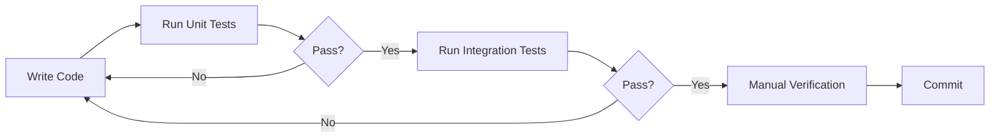

# IdeaForge Testing Strategy

## Executive Summary

This document outlines the comprehensive testing strategy for IdeaForge, a CLI tool that transforms project ideas into actionable plans. Unlike web applications, our testing focuses on command-line interactions, file system operations, and API integrations.

**Platform Priority**: This project targets macOS as the primary platform. Cross-platform compatibility is not a priority. Windows support is not required.

## Testing Principles

1. **Appropriate Testing**: Balance quality assurance with development momentum
2. **Automated First**: Prefer automated tests over manual verification
3. **Fast Feedback**: Tests should run quickly to maintain development flow
4. **Mac-First Development**: Focus on macOS compatibility (cross-platform is not a priority)
5. **Integration Focus**: Test real interactions with files, APIs, and system commands

## Testing Categories

### 1. Unit Testing (Jest/TypeScript)

**Purpose**: Test individual functions and modules in isolation

**Tools**: Jest with ts-jest

**Examples**:
```typescript
// tests/config/loader.test.ts
describe('Config Loader', () => {
  it('should validate required environment variables', () => {
    // Test missing variables throw errors
  });
  
  it('should use defaults for optional variables', () => {
    // Test default values are applied
  });
});
```

### 2. CLI Command Testing

**Purpose**: Verify CLI commands work correctly end-to-end

**Tools**: Node.js child_process, custom test harness

**Test Script Example**:
```bash
#!/bin/bash
# tests/cli/test-commands.sh

# Test help command
OUTPUT=$(./bin/ideaforge --help 2>&1)
if echo "$OUTPUT" | grep -q "Transform your project ideas"; then
    echo "✅ Help command works"
else
    echo "❌ Help command failed"
fi

# Test init command
./bin/ideaforge init
if [ -f "ideaforge-template.org" ]; then
    echo "✅ Init creates template"
    rm ideaforge-template.org
else
    echo "❌ Init failed to create template"
fi
```

**Node.js Test Helper**:
```typescript
// tests/helpers/cli-tester.ts
import { spawn } from 'child_process';
import * as path from 'path';

export class CLITester {
  private cliPath = path.join(__dirname, '../../bin/ideaforge');
  
  async runCommand(args: string[]): Promise<{
    stdout: string;
    stderr: string;
    exitCode: number;
  }> {
    return new Promise((resolve) => {
      const process = spawn('node', [this.cliPath, ...args]);
      let stdout = '';
      let stderr = '';
      
      process.stdout.on('data', (data) => stdout += data);
      process.stderr.on('data', (data) => stderr += data);
      
      process.on('close', (exitCode) => {
        resolve({ stdout, stderr, exitCode: exitCode || 0 });
      });
    });
  }
  
  async testCommand(command: string, expectedOutput: string): Promise<boolean> {
    const result = await this.runCommand([command]);
    return result.stdout.includes(expectedOutput) && result.exitCode === 0;
  }
}
```

### 3. File System Testing

**Purpose**: Verify file operations work correctly

**Test Categories**:
- Template creation
- Org-mode file parsing
- Export file generation
- Cross-platform path handling

**Example Test**:
```typescript
// tests/services/file-operations.test.ts
describe('File Operations', () => {
  const testDir = './test-output';
  
  beforeEach(() => {
    if (!fs.existsSync(testDir)) {
      fs.mkdirSync(testDir);
    }
  });
  
  afterEach(() => {
    fs.rmSync(testDir, { recursive: true, force: true });
  });
  
  it('should create valid org-mode template', async () => {
    const templatePath = path.join(testDir, 'template.org');
    await createTemplate(templatePath);
    
    const content = fs.readFileSync(templatePath, 'utf8');
    expect(content).toContain('#+TITLE:');
    expect(content).toContain('* Project Overview');
  });
});
```

### 4. API Integration Testing

**Purpose**: Test interactions with external APIs (OpenAI, n8n)

**Approach**: Mock in unit tests, real calls in integration tests

**Mock Example**:
```typescript
// tests/services/ai-analyzer.test.ts
jest.mock('axios');

describe('AI Analyzer', () => {
  it('should handle API errors gracefully', async () => {
    axios.post.mockRejectedValue(new Error('API Error'));
    
    const result = await analyzeText('test content');
    expect(result.error).toBe('Failed to analyze text');
  });
});
```

**Integration Test Example**:
```bash
#!/bin/bash
# tests/integration/test-api.sh

# Test with real API (requires .env)
if [ -f .env.test ]; then
  cp .env.test .env
  OUTPUT=$(./bin/ideaforge analyze test-file.org 2>&1)
  
  if echo "$OUTPUT" | grep -q "Analysis complete"; then
    echo "✅ API integration works"
  else
    echo "❌ API integration failed"
    echo "$OUTPUT"
  fi
  
  rm .env
fi
```

### 5. Environment Configuration Testing

**Purpose**: Ensure the tool handles various environment configurations

**Test Matrix**:
```typescript
// tests/config/environment-matrix.test.ts
const configurations = [
  { name: 'missing-all', env: {} },
  { name: 'missing-api-key', env: { N8N_WEBHOOK_URL: 'test' } },
  { name: 'missing-webhook', env: { OPENAI_API_KEY: 'test' } },
  { name: 'valid-minimal', env: { OPENAI_API_KEY: 'test', N8N_WEBHOOK_URL: 'test' } },
  { name: 'valid-full', env: { ...fullEnv } }
];

configurations.forEach(config => {
  it(`should handle ${config.name} configuration`, () => {
    process.env = config.env;
    
    if (config.name.startsWith('missing')) {
      expect(() => loadConfig()).toThrow();
    } else {
      expect(() => loadConfig()).not.toThrow();
    }
  });
});
```

### 6. Platform Compatibility (Low Priority)

**Purpose**: Basic compatibility checks for macOS (primary) and potentially Linux

**Note**: Cross-platform support is NOT a priority. Windows support is not required.

**Minimal Testing**:
```typescript
// tests/utils/platform.test.ts
describe('macOS Compatibility', () => {
  it('should work correctly on macOS', () => {
    if (process.platform !== 'darwin') {
      console.warn('Skipping macOS-specific test on non-Mac platform');
      return;
    }
    
    // macOS-specific tests here
    const filePath = path.join('src', 'cli', 'index.ts');
    expect(filePath).toBe('src/cli/index.ts');
  });
});
```

### 7. Performance Testing

**Purpose**: Ensure operations complete within acceptable time limits

**Test Example**:
```typescript
// tests/performance/response-time.test.ts
describe('Performance Requirements', () => {
  it('should initialize in under 1 second', async () => {
    const start = Date.now();
    await cliTester.runCommand(['init']);
    const duration = Date.now() - start;
    
    expect(duration).toBeLessThan(1000);
  });
  
  it('should analyze small file in under 3 seconds', async () => {
    const start = Date.now();
    await cliTester.runCommand(['analyze', 'small-file.org']);
    const duration = Date.now() - start;
    
    expect(duration).toBeLessThan(3000);
  });
});
```

## Testing Workflow

### 1. Development Testing Cycle



### 2. Pre-Commit Testing

```bash
#!/bin/bash
# .git/hooks/pre-commit

# Run quick tests before commit
npm run test:unit
npm run lint

if [ $? -ne 0 ]; then
    echo "Tests or linting failed. Commit aborted."
    exit 1
fi
```

### 3. CI/CD Testing Pipeline

```yaml
# .github/workflows/test.yml
name: Test Suite

on: [push, pull_request]

jobs:
  test:
    runs-on: macos-latest  # Mac-only focus
    strategy:
      matrix:
        node: [16.x, 18.x, 20.x]
    
    steps:
    - uses: actions/checkout@v3
    - uses: actions/setup-node@v3
      with:
        node-version: ${{ matrix.node }}
    
    - run: npm ci
    - run: npm run build
    - run: npm test
    - run: npm run test:integration
```

## Test Organization

```
tests/
├── unit/                  # Fast, isolated tests
│   ├── config/           # Configuration tests
│   ├── services/         # Service layer tests
│   └── utils/            # Utility function tests
├── integration/          # End-to-end tests
│   ├── cli/             # CLI command tests
│   ├── api/             # API integration tests
│   └── file-ops/        # File operation tests
├── performance/         # Performance benchmarks
├── fixtures/            # Test data files
│   ├── valid-template.org
│   ├── invalid-format.org
│   └── large-document.org
└── helpers/             # Test utilities
    ├── cli-tester.ts
    ├── mock-api.ts
    └── test-env.ts
```

## Testing Commands

```json
// package.json scripts
{
  "scripts": {
    "test": "jest",
    "test:unit": "jest tests/unit",
    "test:integration": "jest tests/integration",
    "test:watch": "jest --watch",
    "test:coverage": "jest --coverage",
    "test:ci": "jest --ci --coverage --maxWorkers=2",
    "test:debug": "node --inspect-brk ./node_modules/.bin/jest --runInBand",
    "test:cli": "./tests/cli/test-commands.sh",
    "test:api": "jest tests/integration/api --runInBand"
  }
}
```

## Coverage Goals

- **Unit Tests**: 80% coverage minimum
- **Integration Tests**: Cover all major user workflows
- **Critical Paths**: 100% coverage for:
  - Configuration loading
  - File I/O operations
  - API error handling
  - Command parsing

## Testing Best Practices

### 1. Test Naming Convention
```typescript
// Good
it('should throw error when API key is missing')
it('should create org file with correct structure')

// Bad
it('test config')
it('works')
```

### 2. Arrange-Act-Assert Pattern
```typescript
it('should parse org-mode file correctly', () => {
  // Arrange
  const testFile = createTestOrgFile();
  
  // Act
  const result = parseOrgFile(testFile);
  
  // Assert
  expect(result.title).toBe('Test Project');
  expect(result.sections).toHaveLength(5);
});
```

### 3. Test Data Builders
```typescript
// tests/helpers/builders.ts
export class OrgFileBuilder {
  private content = '';
  
  withTitle(title: string): this {
    this.content += `#+TITLE: ${title}\n`;
    return this;
  }
  
  withSection(heading: string, content: string): this {
    this.content += `\n* ${heading}\n${content}\n`;
    return this;
  }
  
  build(): string {
    return this.content;
  }
}
```

### 4. Environment Isolation
```typescript
// tests/helpers/test-env.ts
export function withTestEnv(env: Record<string, string>, fn: () => void) {
  const original = process.env;
  process.env = { ...original, ...env };
  
  try {
    fn();
  } finally {
    process.env = original;
  }
}
```

## Debugging Failed Tests

### 1. Verbose Output
```bash
# Run with detailed logging
DEBUG=* npm test

# Run specific test with console output
npm test -- --verbose tests/unit/config.test.ts
```

### 2. Interactive Debugging
```bash
# Debug in VS Code
npm run test:debug

# Then attach VS Code debugger
```

### 3. Test Isolation
```bash
# Run single test file
npm test -- tests/unit/specific.test.ts

# Run single test suite
npm test -- --testNamePattern="Config Loader"
```

## Testing Checklist

Before marking a task complete, ensure:

- [ ] Unit tests written for new functions
- [ ] Integration tests cover the feature end-to-end
- [ ] Error cases are tested
- [ ] Works correctly on macOS
- [ ] Performance requirements met
- [ ] Documentation includes test examples
- [ ] CI/CD pipeline passes

## Cost-Benefit Analysis Framework

When deciding whether to continue testing:

### Continue Testing If:
- Core functionality is being implemented
- API integrations are involved
- File system operations are complex
- macOS-specific issues are suspected
- Previous bugs have been found in this area

### Move Forward If:
- Changes are minor refactoring
- Only UI text has changed
- Tests are becoming repetitive
- Time investment exceeds value
- Feature will be tested as part of larger integration

## Testing Anti-Patterns to Avoid

1. **Testing Implementation Details**: Focus on behavior, not internals
2. **Fragile Tests**: Avoid hardcoded paths, timestamps, or order dependencies
3. **Slow Test Suites**: Keep unit tests under 100ms each
4. **Missing Error Tests**: Always test error paths
5. **Console Pollution**: Clean up console.log statements

## Monitoring and Metrics

Track these metrics to improve testing:

1. **Test Execution Time**: Target < 30 seconds for full suite
2. **Flaky Test Rate**: Should be 0%
3. **Coverage Trends**: Should increase or maintain
4. **Bug Discovery Rate**: Tests should catch bugs before users
5. **Test Maintenance Time**: Should be < 20% of feature time

## Conclusion

This testing strategy ensures IdeaForge maintains high quality while enabling rapid development. By focusing on automated testing for macOS and real-world scenarios, we can confidently ship features that work reliably for our target platform. While the code may work on other platforms, testing efforts are concentrated on macOS to maximize development efficiency. 