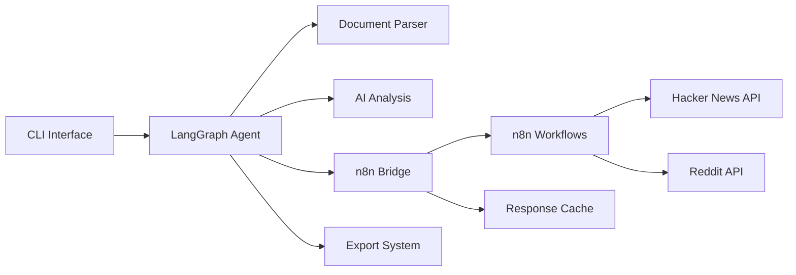

# Task 5.6 Detailed Implementation Part 2: README and Deployment (5.6.4-5.6.5)

## Overview
This file covers updating the project README and creating the n8n deployment guide as part of the documentation tasks for the n8n integration system.

## Implementation Details

### 5.6.4 Update project README

**Objective**: Add n8n integration information to the main project README.

**File to Update**: `README.md`

**Step 1: Add External Research Section**

Add after the main features list:

```markdown
## External Research Integration

IdeaForge can enhance project analysis by searching external sources for relevant discussions and insights. This feature uses n8n workflows to query Hacker News and Reddit for technology-related content.

### Prerequisites

- n8n instance (local or cloud)
- Reddit API credentials (for Reddit search)
- Environment configuration (see below)

### Quick Start

1. Set up n8n workflows:
   ```bash
   # Import workflows to your n8n instance
   cd n8n-workflows
   ./deploy.sh
   ```

2. Configure environment:
   ```bash
   # Copy example env file
   cp .env.example .env
   
   # Edit with your settings
   N8N_BASE_URL=http://localhost:5678
   N8N_API_KEY=your-api-key
   ```

3. Run analysis with research:
   ```bash
   ideaforge analyze project.org --research
   ```
```

**Step 2: Update Features List**

Modify the existing features section:

```markdown
## Features

- 📝 Parse org-mode project templates
- 🤖 AI-powered requirement analysis using LangGraph
- 🎯 MoSCoW and Kano prioritization frameworks
- 🔍 **External research via Hacker News and Reddit** ← NEW
- 📊 Generate visualization diagrams
- 🔄 Iterative refinement process
- 📁 Multiple export formats
```

**Step 3: Add Research Configuration Table**

```markdown
### Research Configuration

| Environment Variable | Description | Default |
|---------------------|-------------|---------|
| N8N_BASE_URL | n8n instance URL | http://localhost:5678 |
| N8N_API_KEY | API key for webhook auth | - |
| N8N_TIMEOUT | Request timeout (ms) | 30000 |
| CACHE_TTL_MINUTES | Cache duration | 60 |
| REDDIT_CLIENT_ID | Reddit app client ID | - |
| REDDIT_CLIENT_SECRET | Reddit app secret | - |

For detailed setup instructions, see [n8n Setup Guide](docs/n8n-setup.md).
```

**Step 4: Update Architecture Diagram**

Replace the existing architecture section with:

```markdown
## Architecture



The architecture now includes:
- **n8n Bridge**: Manages communication between LangGraph and n8n
- **n8n Workflows**: Handles external API requests with rate limiting
- **Response Cache**: Reduces API calls with intelligent caching
```

**Step 5: Add CLI Examples**

Update the usage section:

```markdown
## Usage

### Basic Analysis
```bash
ideaforge analyze my-project.org
```

### Analysis with External Research
```bash
# Enable all research sources
ideaforge analyze my-project.org --research

# Specify specific sources
ideaforge analyze my-project.org --research --sources hackernews

# Add custom research topics
ideaforge analyze my-project.org --research --topics "GraphQL,microservices"
```

### Research Features
- **Automatic Technology Detection**: Extracts technologies from your project
- **Hacker News Integration**: Finds relevant technical discussions
- **Reddit Search**: Discovers insights from programming communities
- **Smart Caching**: Caches results for 60 minutes to reduce API calls
- **Rate Limiting**: Respects API limits automatically
```

**Testing the README Update**:
1. Verify all markdown renders correctly
2. Test all code examples work
3. Ensure links to documentation are valid
4. Check mermaid diagram displays properly

### 5.6.5 Create n8n deployment guide

**Objective**: Build comprehensive deployment documentation for n8n workflows.

**File to Create**: `docs/n8n-deployment-guide.md`

**Document Structure**:

```markdown
# n8n Deployment Guide

This guide covers deploying n8n workflows for IdeaForge's external research features.

## Table of Contents
1. [Local Development Setup](#local-development)
2. [Cloud Deployment](#cloud-deployment)
3. [Workflow Import](#workflow-import)
4. [Security Configuration](#security)
5. [Monitoring & Maintenance](#monitoring)
6. [Troubleshooting](#troubleshooting)
```

**Section 1: Local Development Setup**

```markdown
## Local Development Setup

### Option 1: Docker (Recommended)

Create a `docker-compose.yml` file:

```yaml
version: '3.8'

services:
  n8n:
    image: n8nio/n8n
    ports:
      - "5678:5678"
    environment:
      - N8N_BASIC_AUTH_ACTIVE=true
      - N8N_BASIC_AUTH_USER=admin
      - N8N_BASIC_AUTH_PASSWORD=${N8N_PASSWORD}
      - N8N_ENCRYPTION_KEY=${N8N_ENCRYPTION_KEY}
    volumes:
      - n8n_data:/home/node/.n8n
      - ./n8n-workflows:/workflows

volumes:
  n8n_data:
```

Start n8n:
```bash
# Generate secure keys
export N8N_ENCRYPTION_KEY=$(openssl rand -hex 32)
export N8N_PASSWORD=$(openssl rand -hex 16)

# Save to .env file
echo "N8N_ENCRYPTION_KEY=$N8N_ENCRYPTION_KEY" >> .env
echo "N8N_PASSWORD=$N8N_PASSWORD" >> .env

# Start services
docker-compose up -d

# View logs
docker-compose logs -f n8n
```

### Option 2: NPM Installation

```bash
# Install globally
npm install -g n8n

# Start n8n
N8N_PORT=5678 n8n start

# Start with authentication
N8N_BASIC_AUTH_ACTIVE=true \
N8N_BASIC_AUTH_USER=admin \
N8N_BASIC_AUTH_PASSWORD=password \
n8n start
```

### Verify Installation

```bash
# Check health endpoint
curl http://localhost:5678/

# Access UI
open http://localhost:5678
```
```

**Section 2: Cloud Deployment Options**

```markdown
## Cloud Deployment

### n8n Cloud (Easiest)

1. Sign up at [n8n.cloud](https://n8n.cloud)
2. Create a new workspace
3. Note your webhook URL format:
   ```
   https://YOUR-WORKSPACE.n8n.cloud/webhook/
   ```
4. Import workflows through the UI

### Self-Hosted Options

#### Heroku Deployment

```bash
# Clone n8n
git clone https://github.com/n8n-io/n8n.git
cd n8n

# Create Heroku app
heroku create ideaforge-n8n

# Configure environment
heroku config:set N8N_BASIC_AUTH_ACTIVE=true
heroku config:set N8N_BASIC_AUTH_USER=admin
heroku config:set N8N_BASIC_AUTH_PASSWORD=$PASSWORD
heroku config:set N8N_ENCRYPTION_KEY=$ENCRYPTION_KEY
heroku config:set N8N_WEBHOOK_URL=https://ideaforge-n8n.herokuapp.com/

# Deploy
git push heroku main

# Open app
heroku open
```

#### AWS EC2 Deployment

1. Launch EC2 instance (t3.small minimum)
2. Install Docker:
   ```bash
   sudo yum update -y
   sudo yum install docker -y
   sudo service docker start
   sudo usermod -a -G docker ec2-user
   ```
3. Deploy using docker-compose (see local setup)
4. Configure security group for port 5678

#### Platform-Specific Guides
- [AWS Deployment](https://docs.n8n.io/hosting/installation/aws/)
- [Google Cloud](https://docs.n8n.io/hosting/installation/gcp/)
- [Azure](https://docs.n8n.io/hosting/installation/azure/)
- [Digital Ocean](https://docs.n8n.io/hosting/installation/digital-ocean/)
```

**Section 3: Workflow Import Process**

```markdown
## Workflow Import

### Automated Deployment Script

Create `n8n-workflows/deploy.sh`:

```bash
#!/bin/bash

# Configuration
N8N_URL="${N8N_BASE_URL:-http://localhost:5678}"
N8N_USER="${N8N_BASIC_AUTH_USER:-admin}"
N8N_PASS="${N8N_BASIC_AUTH_PASSWORD:-password}"

# Colors for output
GREEN='\033[0;32m'
RED='\033[0;31m'
NC='\033[0m'

echo "Deploying n8n workflows to $N8N_URL"

# Check connectivity
if ! curl -s -u "$N8N_USER:$N8N_PASS" "$N8N_URL/api/v1/workflows" > /dev/null; then
    echo -e "${RED}Error: Cannot connect to n8n at $N8N_URL${NC}"
    exit 1
fi

# Import workflows
for workflow in *.json; do
    echo -n "Importing $workflow... "
    
    response=$(curl -s -X POST "$N8N_URL/api/v1/workflows" \
        -u "$N8N_USER:$N8N_PASS" \
        -H "Content-Type: application/json" \
        -d @"$workflow")
    
    if echo "$response" | grep -q '"id"'; then
        echo -e "${GREEN}✓${NC}"
    else
        echo -e "${RED}✗${NC}"
        echo "Error: $response"
    fi
done

# Activate workflows
echo "Activating workflows..."
curl -X PATCH "$N8N_URL/api/v1/workflows" \
    -u "$N8N_USER:$N8N_PASS" \
    -H "Content-Type: application/json" \
    -d '{"active": true}'

echo -e "${GREEN}Deployment complete!${NC}"
```

Make executable and run:
```bash
chmod +x n8n-workflows/deploy.sh
./n8n-workflows/deploy.sh
```

### Manual Import via UI

1. Access n8n at your instance URL
2. Navigate to Workflows
3. Click "Import from File" or drag-and-drop
4. Import each workflow:
   - `hackernews-search.json`
   - `reddit-search.json`
   - `health-check.json`
5. Activate each workflow using the toggle
```

**Section 4: Security Best Practices**

```markdown
## Security Configuration

### Webhook Authentication

1. Generate secure API key:
   ```bash
   # Generate 32-character key
   openssl rand -hex 32
   ```

2. Configure in each webhook node:
   - Open workflow in n8n
   - Edit Webhook node
   - Authentication → Header Auth
   - Header Name: `X-API-Key`
   - Header Value: Your generated key

3. Configure IdeaForge:
   ```bash
   # .env file
   N8N_API_KEY=your-generated-key
   ```

### SSL/TLS Setup

For production, always use HTTPS:

#### Using Nginx Reverse Proxy

```nginx
server {
    listen 80;
    server_name n8n.yourdomain.com;
    return 301 https://$server_name$request_uri;
}

server {
    listen 443 ssl http2;
    server_name n8n.yourdomain.com;
    
    ssl_certificate /etc/letsencrypt/live/n8n.yourdomain.com/fullchain.pem;
    ssl_certificate_key /etc/letsencrypt/live/n8n.yourdomain.com/privkey.pem;
    
    location / {
        proxy_pass http://localhost:5678;
        proxy_http_version 1.1;
        proxy_set_header Upgrade $http_upgrade;
        proxy_set_header Connection 'upgrade';
        proxy_set_header Host $host;
        proxy_set_header X-Real-IP $remote_addr;
        proxy_set_header X-Forwarded-For $proxy_add_x_forwarded_for;
        proxy_set_header X-Forwarded-Proto $scheme;
        proxy_cache_bypass $http_upgrade;
    }
}
```

#### Let's Encrypt Certificate

```bash
# Install certbot
sudo apt-get update
sudo apt-get install certbot python3-certbot-nginx

# Get certificate
sudo certbot --nginx -d n8n.yourdomain.com

# Auto-renewal
sudo certbot renew --dry-run
```

### Access Control

1. **IP Whitelisting** (nginx):
   ```nginx
   location /webhook/ {
       allow 192.168.1.0/24;
       allow 10.0.0.0/8;
       deny all;
       proxy_pass http://localhost:5678;
   }
   ```

2. **Rate Limiting**:
   ```nginx
   limit_req_zone $binary_remote_addr zone=n8n:10m rate=10r/s;
   
   location /webhook/ {
       limit_req zone=n8n burst=20 nodelay;
       proxy_pass http://localhost:5678;
   }
   ```
```

**Section 5: Monitoring Setup**

```markdown
## Monitoring & Maintenance

### Health Monitoring

Create `monitoring/check-n8n.sh`:

```bash
#!/bin/bash

N8N_URL="${N8N_BASE_URL:-http://localhost:5678}"
SLACK_WEBHOOK="${SLACK_WEBHOOK_URL}"

# Check health endpoint
if ! curl -f -s "$N8N_URL/webhook/ideaforge/health" > /dev/null; then
    # Send alert
    if [ -n "$SLACK_WEBHOOK" ]; then
        curl -X POST "$SLACK_WEBHOOK" \
            -H 'Content-Type: application/json' \
            -d '{"text":"⚠️ n8n health check failed!"}'
    fi
    exit 1
fi

# Check workflow status
response=$(curl -s "$N8N_URL/webhook/ideaforge/health")
if ! echo "$response" | grep -q '"status":"healthy"'; then
    echo "Unhealthy status: $response"
    exit 1
fi

echo "✅ n8n is healthy"
```

Add to crontab:
```bash
*/5 * * * * /path/to/monitoring/check-n8n.sh
```

### Backup Strategy

Create daily backups:

```bash
#!/bin/bash
# backup-n8n.sh

DATE=$(date +%Y%m%d_%H%M%S)
BACKUP_DIR="/backups/n8n/$DATE"

mkdir -p "$BACKUP_DIR"

# Export workflows
docker exec n8n n8n export:workflow \
    --all \
    --output="$BACKUP_DIR/workflows.json"

# Export credentials (encrypted)
docker exec n8n n8n export:credentials \
    --all \
    --output="$BACKUP_DIR/credentials.json"

# Backup database
docker exec n8n-db pg_dump -U n8n \
    > "$BACKUP_DIR/database.sql"

# Compress
tar -czf "$BACKUP_DIR.tar.gz" "$BACKUP_DIR"
rm -rf "$BACKUP_DIR"

# Keep only last 30 days
find /backups/n8n -name "*.tar.gz" -mtime +30 -delete
```

### Performance Monitoring

Monitor key metrics:

```javascript
// Add to n8n workflow
const metrics = {
  webhookReceived: Date.now(),
  externalApiCalls: 0,
  cacheHits: 0,
  totalDuration: 0
};

// Log metrics
console.log('Performance metrics:', JSON.stringify(metrics));
```
```

## Testing the Deployment

After completing the deployment:

1. **Test webhook connectivity**:
   ```bash
   curl -X POST http://localhost:5678/webhook/ideaforge/health
   ```

2. **Verify authentication**:
   ```bash
   curl -X POST http://localhost:5678/webhook/ideaforge/hackernews-search \
     -H "X-API-Key: your-key" \
     -H "Content-Type: application/json" \
     -d '{"query": "test", "sessionId": "test-123"}'
   ```

3. **Check workflow execution**:
   - Access n8n UI
   - Go to Executions
   - Verify successful runs

## Definition of Done

✅ n8n deployment guide is complete and tested
✅ All deployment options are documented
✅ Security best practices are included
✅ Monitoring and backup procedures are defined
✅ README.md is updated with research features
✅ Architecture diagram includes n8n integration 